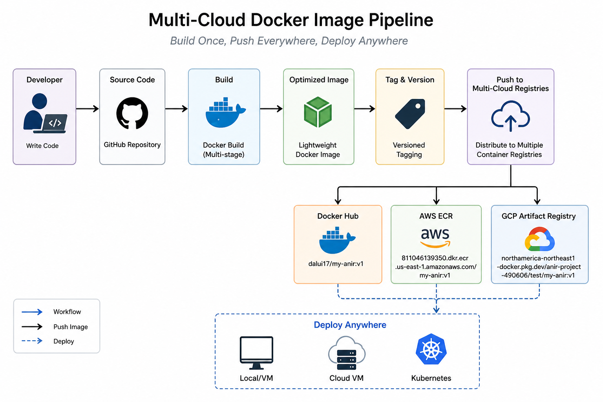
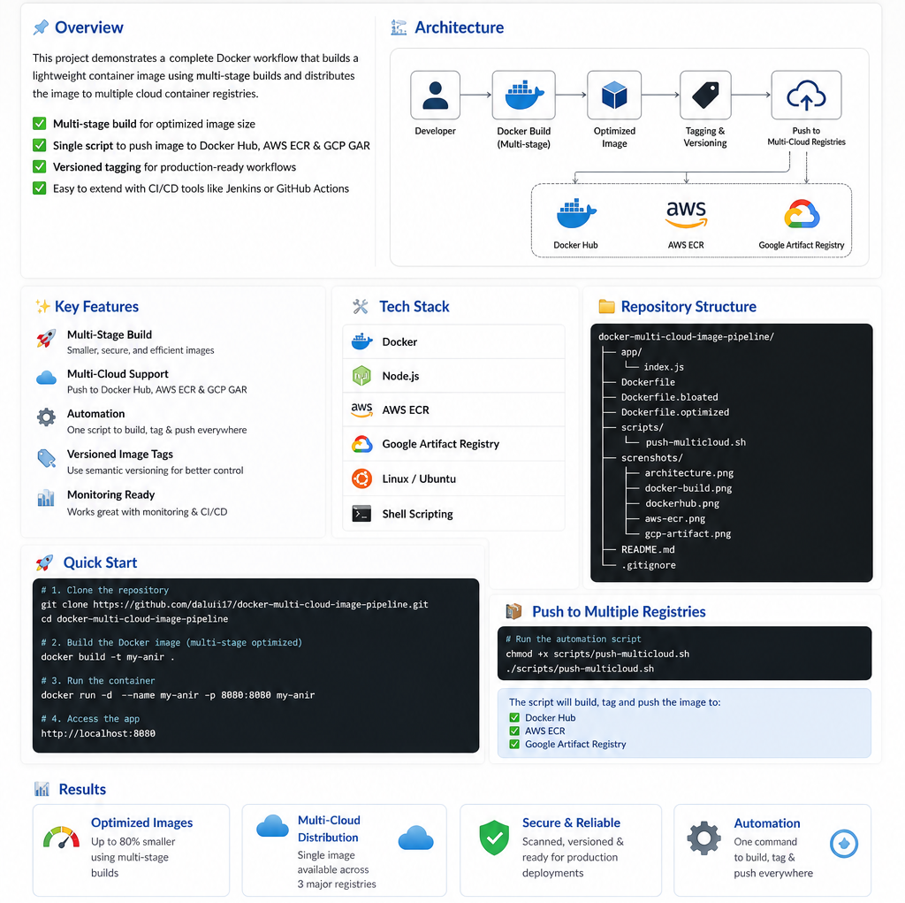
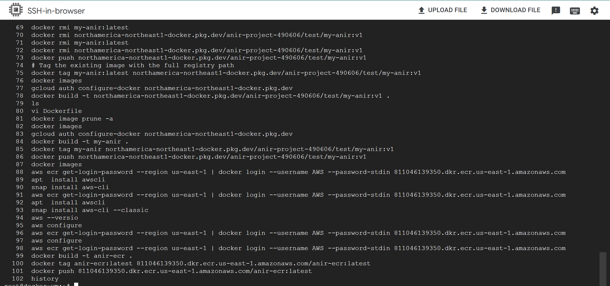

# 🚀 Multi-Cloud Docker Image Pipeline


<p align="center">
  
  
  
  
  
  
  
</p>

<p align="center">
<b>Build Once. Push Everywhere. Deploy Anywhere.</b>
</p>

---

## 📌 Overview

This project demonstrates a **production-style Docker pipeline** that:

✅ Builds optimized container images using multi-stage builds
✅ Reduces image size (Alpine optimization)
✅ Pushes the SAME image to multiple cloud registries
✅ Automates everything using a single script

---

## 🏗️ Architecture

<p align="center">
  
</p>

---

## ⚙️ Tech Stack

* 🐳 Docker
* ☁️ AWS ECR
* 🌐 Google Artifact Registry
* 📦 Docker Hub
* 🐧 Linux (Ubuntu)
* ⚡ Shell Scripting

---

## 🔥 Key Features

### 🐳 Multi-Stage Build Optimization

* Lightweight production images
* Faster deployment
* Improved security

---

### ☁️ Multi-Cloud Distribution

Push images to:

* Docker Hub
* AWS ECR
* GCP Artifact Registry

---

### ⚡ One-Click Automation

```bash
./scripts/push-multicloud.sh
```

---

### 🏷️ Versioned Tagging

```bash
app:v1
app:v2
app:prod
```

---

## 🚀 Quick Start

### 1️⃣ Clone Repo

```bash
git clone https://github.com/Dalui17/docker-multi-cloud-image-pipeline.git
cd docker-multi-cloud-image-pipeline
```

---

### 2️⃣ Build Image

```bash
docker build -t my-anir .
```

---

### 3️⃣ Run Container

```bash
docker run -d -p 80:80 my-anir
```

---

## 📦 Multi-Cloud Push Flow

### 🐳 Docker Hub

```bash
docker tag my-anir dalui17/my-anir:v1
docker push dalui17/my-anir:v1
```

---

### ☁️ AWS ECR

```bash
aws ecr get-login-password --region us-east-1 | docker login --username AWS --password-stdin <account>.dkr.ecr.us-east-1.amazonaws.com

docker tag my-anir <ecr-repo>/my-anir:v1
docker push <ecr-repo>/my-anir:v1
```

---

### 🌐 GCP Artifact Registry

```bash
gcloud auth configure-docker northamerica-northeast1-docker.pkg.dev

docker tag my-anir <gcp-repo>/my-anir:v1
docker push <gcp-repo>/my-anir:v1
```

---

## 📸 Screenshots

### 🧱 Architecture

<p align="center">
  
</p>

---

## 📊 Results

* 🚀 Multi-stage optimization implemented
* ☁️ Successfully pushed to 3 cloud platforms
* ⚡ Fully automated pipeline
* 📦 Production-ready container workflow

---

## 🎯 Future Enhancements

* 🔗 Jenkins CI/CD integration
* ☸️ Kubernetes deployment
* 📊 Monitoring (Prometheus + Grafana)

---

## 👨‍💻 Author

**Anirban Dalui**

DevOps Engineer | Multi-Cloud Enthusiast

---

## ⭐ Support

If you like this project, give it a ⭐ on GitHub

